

# SEAT HEATING MECHANISM

1. THE USER ENTERS INTO CAR AND OCCUPIES THE SEAT.
2. AND THEN HE TURNS ON THE HEAT SENSOR.
3. IF BOTH THE ABOVE CONDITION ARE MEET THE LED WILL TURN ON.
4. THEN THE USER ABJUST THE TEMPERTURE.
5. THE TEMPERATURE VALUE IS DISPLAYED ON THE SCREEN.
6. THEN THE SEAT WILL BE COOLED ACCORDINGLY.

# SIMULATION RESULTS:

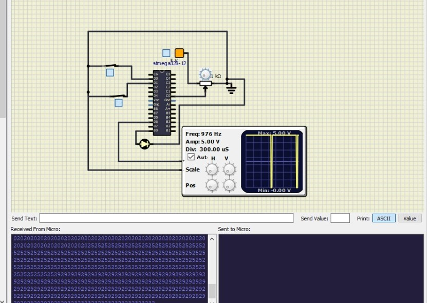
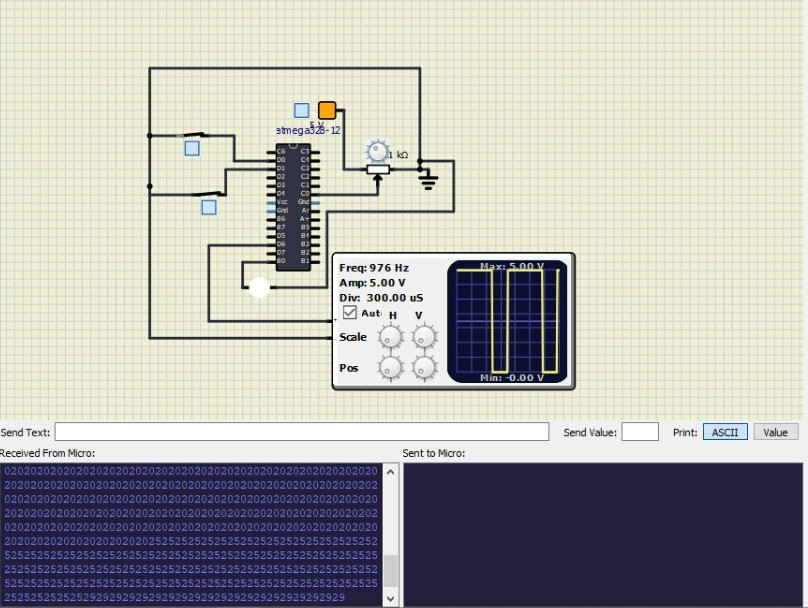
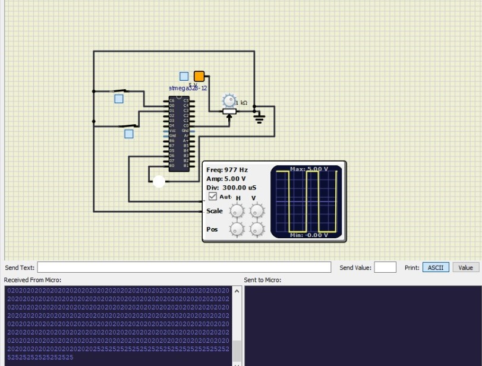
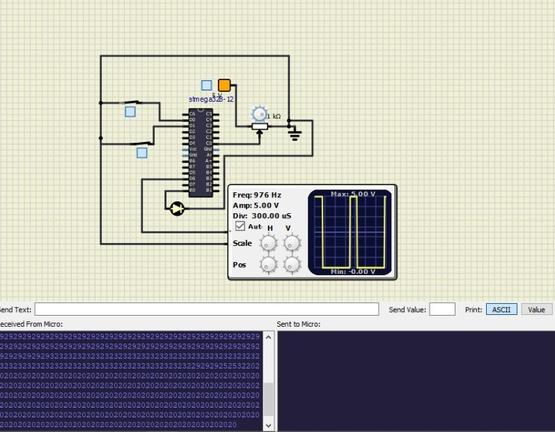

----
# ACTIVITY 1
 
### If the user seated ontoTthe seat and then he had turned on the heatbutton , only then the led should turn on.
|LOGIC STATE |LED STATUS|
|---|---|
|0  0|  OFF|
|0 1|OFF|
|1 0 |OFF|
|1 1 |ON|
## Simulation results
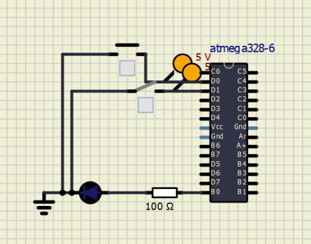
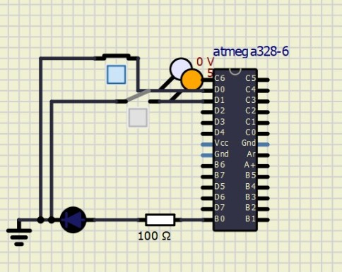 
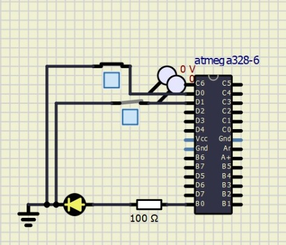

----
# ACTIVITY 2
  
### To take input from temp sensor and to indicate changes at a particular temparture.
Since temp sensor is not availaible in simul ide made use of potentiometer and calculated the voltages for particuar range.

|Voltage(V) |Analog Value|Status|
|--- |---|---|
|  0-1.0 |0-200|B1 LED on|
|1.2-2.4|	210-500|	B2 LED on|
|2.5-3.6|	510-700	|B3 LED on|
|3.8-5.0|	710-1024|	B4 LED on|

## Simulation Results:
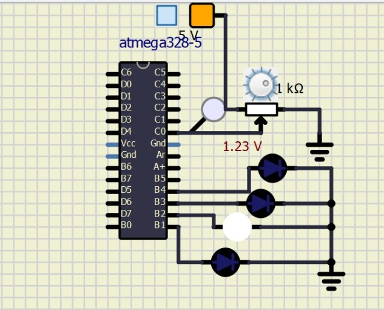
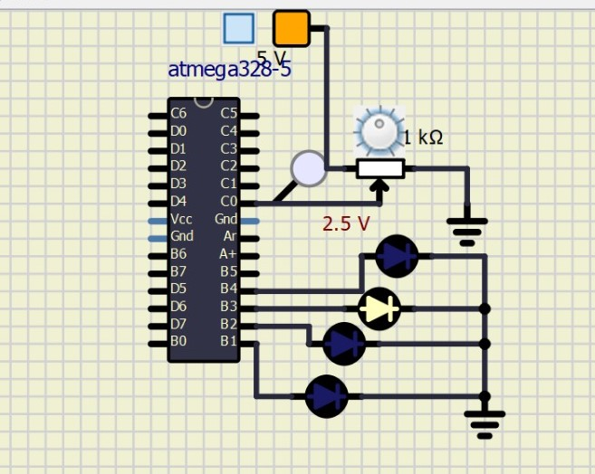 
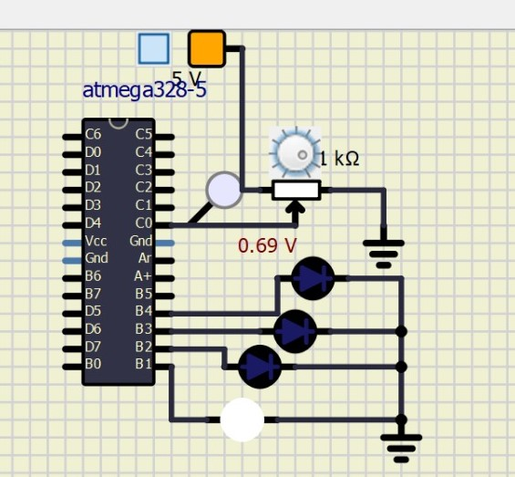

----
# ACTIVITY 3

### To generate pwm at different analog values.

|ADC Value(Temp Sensor)|Output PWM|
|---|---|
|0-200 |20%| 
|210-500 |40%| 
|510-700 |70% |
|710-1024| 95% |

## Simulation Results:

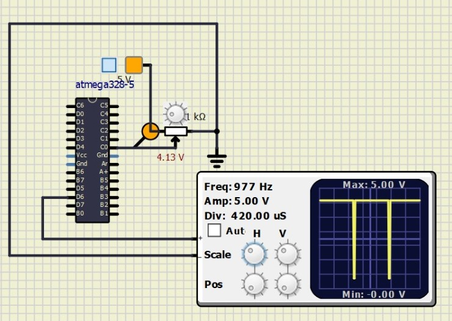
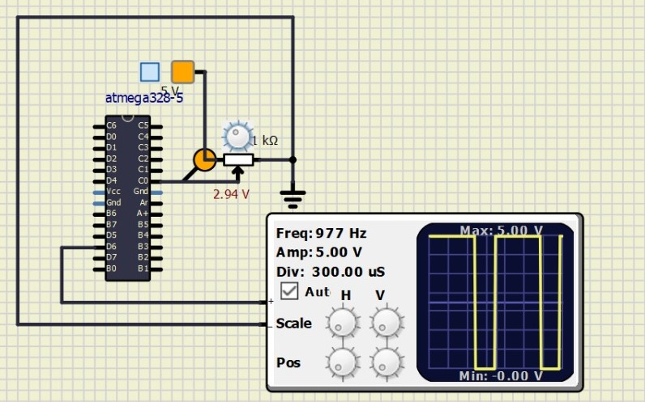 
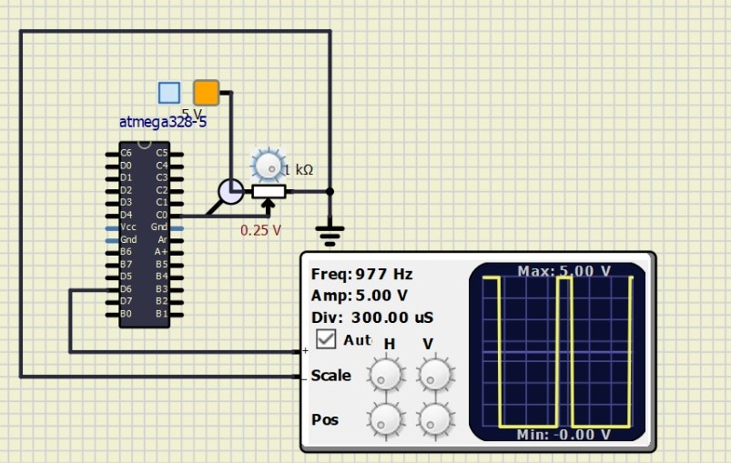
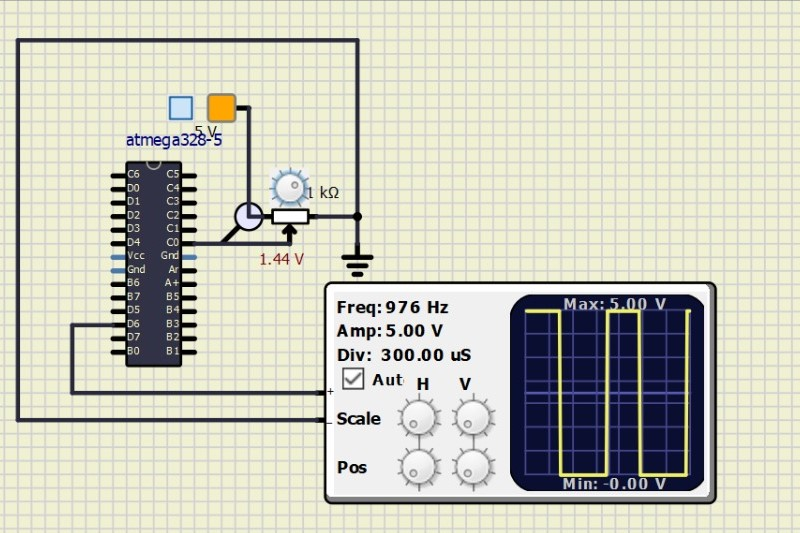

# ACTIVITY 4
### To send the temperature value to a Serail monitor.

